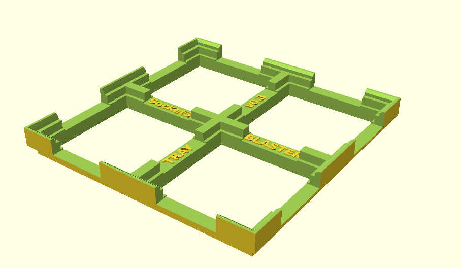
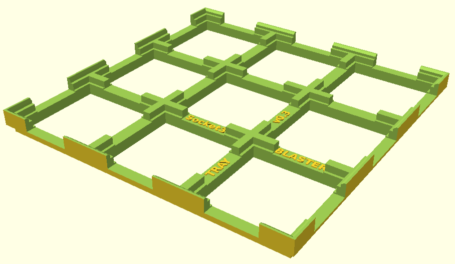
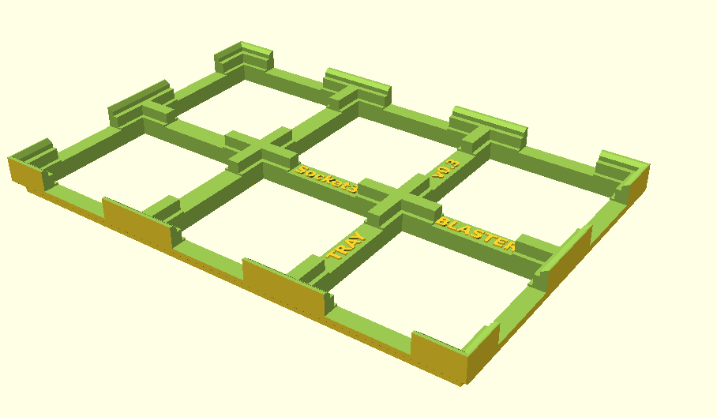
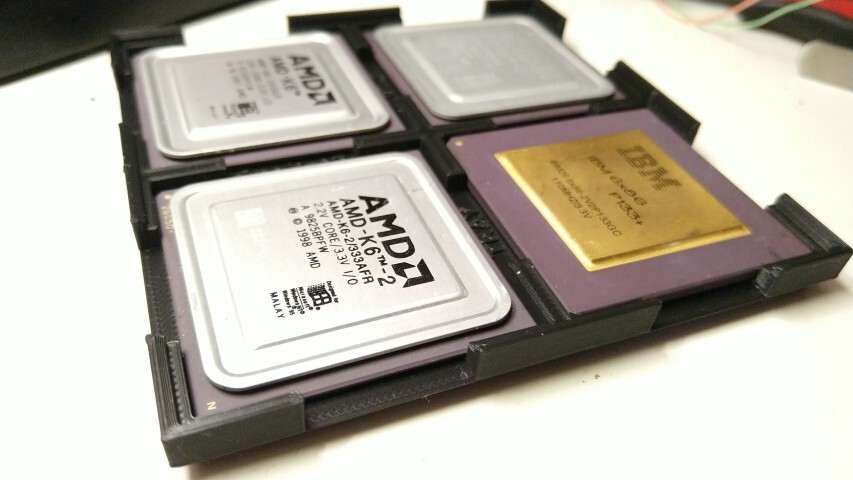
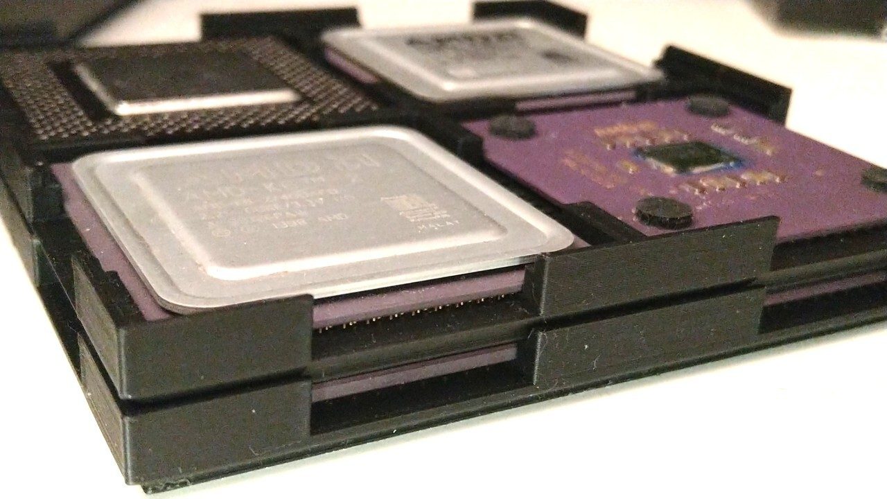

# CPU Tray Blaster

A stackable, easy to print, 3D-printed CPU tray for many types of CPUs.

<p float="left">



</p>

<p float="left">


</p>

# Download STLs

You can [download](https://github.com/scrapcomputing/cpu_tray_blaster/releases) the zipped STL files for all sockets and several grid sizes in the releases.

# Features

- Stackable (only for same socket and grid size)
- Easy to place/remove CPUs
- Print with no supports and ready to use after print
- Structurally not too flimsy
- Kind on CPU pins as the pins are floating and not touching the tray
- Adjustable grid size from 1x1 to any NxM
- Large number of supported sockets (see below) and easy to add new ones
- CPUs can be placed in any orientation, no key.

# 3D-printing options

- No supports
- Prints fine on an Ender 3 style printer in standard quality
- Orientation: as shown in photos

# Disclaimer

This may not be a good CPU storage solution if you care about not having your CPUs get damaged from electrostatic discharge.
PLA, to the best of my knowledge, is not a safe material from the electrostatic sensitivity perspective.
So proceed at your own risk!

# Supported sockets

Compatibility is based on the CPU dimensions, not the pin count.
For example, Socket A CPUs fit in Socket 7 trays because the external dimensions of an Athlon Socket A CPU are identical on the X and Y axis, but Socket 7 CPUs can be taller, so Socket A trays won't necessarily fit some tall Cyrix 6x86.

| Name       |  Description                                 |
|------------|----------------------------------------------|
| socket3    | All 486 CPUs, am5x86, Cyrix 5x86             |
| socket4    | Only the early Pentium 60/66                 |
| socket7    | Pentium, K5, K6, Cyrix 6x86, K7, Pentium iii |
| socket370  | Pentium iii, Celeron                         |
| socketA    | K7 Athlons, Durons                           |
| socket478  | Pentium IV Northwood+                        |
| socketAM   | Athlon 64 754, 939, AM1, AM2, AM3, AM4       |
| socketCore | 775, 1150, 1151 Core Duo,i3,15,i7            |
| socket1366 | Xeon, i7-9xx                                 |
| socket2011 | Xeon and E-class Core i7s                    |
| socketG34  | Some Opteron versions                        |

# Build from source

## Easy

Open `cpu_tray_blaster.scad` in [https://openscad.org/](OpenScad), then export to stl.

## Bulk

Use `make` to generate one or more cpu tray stl files.

```
openscad=/path/to/openscad make                   # for a 2x2 stl files for all sockets
openscad=/path/to/openscad make -j 4              # same but with 4 jobs in parallel (faster)
openscad=/path/to/openscad make socket3_2x2.stl   # for a 2x2 socket3 stl file
openscad=/path/to/openscad make socket7_3x3.stl   # for a 3x3 socket7 stl file
openscad=/path/to/openscad grid_x=3 grid_y=3 make # for all 3x3 sockets
```

For a full set of supported sockets please refer to `params.json`.

# Change Log
- Rev 0.3: Initial public release.


# License
The project is GPLv2.
